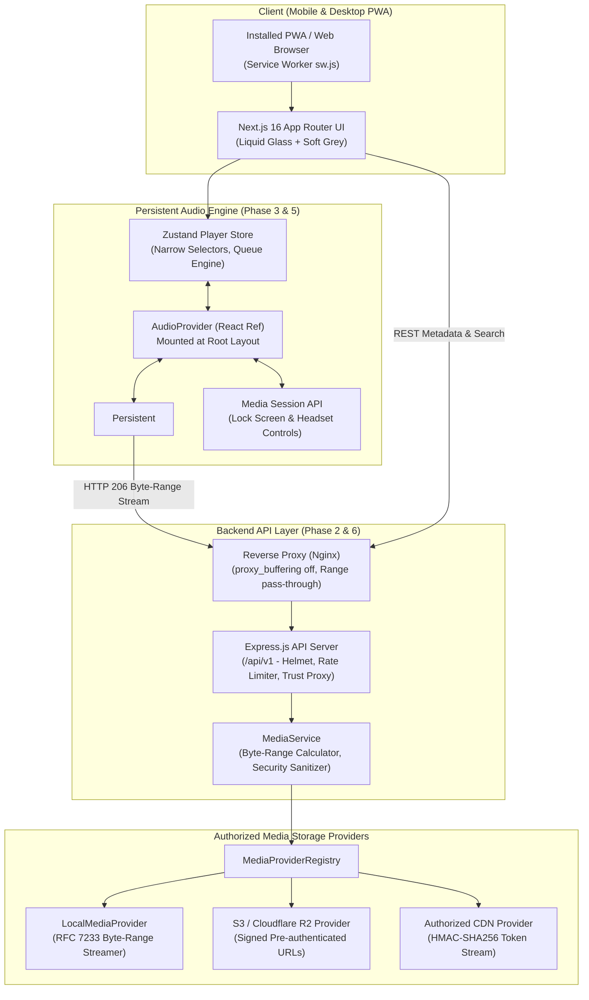

# WMusic 🎵

> A production-ready, mobile-first Progressive Web Application (PWA) audio player engineered with Next.js 16 (App Router), Express.js, a persistent native HTML5 Audio Engine, Media Session API, Audius Open Music provider, and official YouTube streaming.

---

## 🌟 Architecture & Diagrams

WMusic separates UI, playback orchestration, state management, and media delivery into clean, decoupled layers.

### 1. End-to-End System Architecture



---

### 2. Player Engine & State Synchronization

```mermaid
sequenceDiagram
    autonumber
    participant User as User / UI
    participant Store as Zustand Store (player-store.ts)
    participant Bridge as AudioBridge
    participant Provider as AudioProvider (Root Layout)
    participant Audio as Persistent HTMLAudioElement
    participant OS as OS Media Session API

    User->>Store: selectTrack(track)
    Store->>Store: Increment generationId, set status='loading'
    Store->>Bridge: loadTrack(track, autoPlay=true)
    Bridge->>Provider: loadTrack command
    Provider->>Audio: audio.src = streamUrl; audio.load();
    Provider->>OS: updateMetadata(title, artist, artwork)
    Provider->>Audio: audio.play() (Promise)
    
    alt Play Promise Resolved
        Audio-->>Provider: 'playing' event
        Provider->>Store: _setStatus('playing'), _setIsPlaying(true)
        Provider->>OS: setPlaybackState('playing'), setPositionState()
    else Autoplay Blocked (NotAllowedError)
        Audio-->>Provider: NotAllowedError rejected
        Provider->>Store: _setStatus('paused'), _setError(AUTOPLAY_BLOCKED)
        Store-->>User: Show PlayerErrorBanner ("Tap play to start")
    end

    loop High-Frequency Progress
        Audio-->>Provider: 'timeupdate' event
        Provider->>Store: _setTime(throttled ~200ms)
        Provider->>OS: setPositionState(throttled ~1s)
    end
```

---

## 📁 Directory Structure

```
music-app/
├── apps/
│   ├── web/                              # Next.js 16 (App Router) Mobile-First PWA
│   │   ├── src/
│   │   │   ├── app/                      # App Router routes (/, /search, /library, /offline, /lyrics)
│   │   │   │   ├── layout.tsx            # Root layout with persistent AudioProvider
│   │   │   │   ├── manifest.ts           # App Router Web App Manifest
│   │   │   │   └── globals.css           # Liquid Glass tokens, safe areas, animations
│   │   │   ├── components/
│   │   │   │   ├── layout/               # Header, BottomNav, Sidebar, Toasts, PageTransition
│   │   │   │   ├── player/               # AudioProvider, MiniPlayer, FullPlayer, QueueDrawer, Scrubber
│   │   │   │   └── search/               # Debounced SearchInput, SearchResults, Skeletons
│   │   │   ├── lib/
│   │   │   │   └── audio-bridge.ts       # Audio bridge decoupling DOM from Zustand
│   │   │   ├── services/
│   │   │   │   └── media-session.ts      # Defensive Media Session API service
│   │   │   ├── stores/
│   │   │   │   └── player-store.ts       # Strongly typed player store with queue engine
│   │   │   └── types/
│   │   ├── public/
│   │   │   ├── sw.js                     # Custom versioned PWA Service Worker
│   │   │   ├── manifest.json             # PWA Webmanifest matching #F3F4F6 design tokens
│   │   │   ├── icon.svg                  # Scalable vector master icon
│   │   │   ├── icon-192.png              # 192x192 maskable PWA icon
│   │   │   └── icon-512.png              # 512x512 maskable PWA icon
│   │   └── test/
│   │       ├── phase3-phase4.test.ts     # Audio engine & PWA verification tests
│   │       ├── phase5-phase6.test.ts     # Motion, selectors & deployment tests
│   │       └── run-all.ts                # Master web test runner
│   │
│   └── api/                              # Express.js Audio Streaming Backend
│       ├── src/
│       │   ├── config/                   # Validated environment configuration
│       │   ├── controllers/              # Track, Search, Stream (RFC 206 Partial Content)
│       │   ├── middleware/               # Helmet, rate-limiter, request-logger, error-handler
│       │   ├── providers/                # MediaProvider abstraction (Local, S3/R2, CDN)
│       │   ├── routes/                   # Versioned /api/v1 routes
│       │   ├── schemas/                  # Zod validation schemas
│       │   ├── services/                 # MediaService & audio generators
│       │   ├── utils/                    # Structured Pino logger
│       │   ├── app.ts                    # Express application factory with trust proxy
│       │   └── index.ts                  # Server entrypoint with graceful shutdown (SIGTERM/SIGINT)
│       ├── media/                        # Authorized audio catalog & synchronized LRC files
│       ├── Dockerfile                    # Production multi-stage Dockerfile (non-root node user)
│       └── test/
│           └── phase2-stream.test.ts     # RFC 7233 byte-range & security tests
│
├── packages/
│   └── shared/                           # Shared TypeScript models and interfaces
│       └── src/
│           ├── models/                   # Track, MediaProvider, Player, Lyrics, Api envelopes
│           └── index.ts
│
├── docker/
│   ├── docker-compose.yml                # Multi-container orchestration
│   ├── Dockerfile.api                    # Multi-stage production container for API
│   ├── Dockerfile.web                    # Next.js standalone container
│   └── nginx.conf                        # VPS Nginx reverse proxy with proxy_buffering off
│
├── pnpm-workspace.yaml
├── package.json
└── README.md
```

---

## 🛠️ Technology Stack

| Area | Technology | Purpose |
|---|---|---|
| **Frontend Framework** | **Next.js 16.3.8 (App Router)** | React 19, Turbopack, static prerendering & dynamic streaming |
| **State Management** | **Zustand 5.0.3** | High-performance state with narrow selectors and localStorage persistence |
| **Audio Engine** | **HTML5 Audio + Media Session API** | Single persistent audio element, native media events, OS lockscreen controls |
| **Styling & Design** | **Tailwind CSS 3.4.17** | Liquid Glass tokens, Soft Grey (`#F3F4F6`), safe-area insets |
| **Motion & Gestures** | **Framer Motion 12.4.7** | Shared element artwork transitions, pull-down dismiss, page fades |
| **PWA & Offline** | **Custom Service Worker (`sw.js`)** | 6-tier caching strategy, strict audio bypass, non-disruptive update UX |
| **Backend Framework** | **Express.js 4.21.2** | Versioned `/api/v1` endpoints, RFC byte-range streaming, trust proxy |
| **Security & Validation** | **Helmet, Express Rate Limit, Zod** | Secure headers, DDoS protection, request input validation |
| **Observability** | **Pino Structured Logger** | JSON logs with request IDs, response times, and sanitization |
| **Monorepo Tooling** | **pnpm Workspaces + TypeScript 5.7** | Strict mode across monorepo, zero cross-boundary type leaks |

---

## 🛡️ Authorized Media Source Policy

To guarantee full legal compliance:
- ❌ **No YouTube audio extraction, stream scraping, or hidden YouTube players.**
- ❌ **No conversion of YouTube video into raw MP3/audio or proxying extracted streams.**
- ✅ **Built entirely around a `MediaProvider` abstraction contract** (`IMediaProvider`):
  - **LocalMediaProvider**: Streams authorized media files directly with RFC 7233 byte-range slicing.
  - **S3MediaProvider**: Generates short-lived, pre-signed URLs for MinIO, Cloudflare R2, or AWS S3.
  - **AuthorizedCdnMediaProvider**: Produces HMAC-SHA256 signed CDN URLs with expiry tokens.

---

## ⚙️ Environment Variables

### Frontend (`apps/web/.env.example` & `.env.production.example`)
```env
# URL pointing to the Express backend (Must be HTTPS in production)
NEXT_PUBLIC_API_URL=http://localhost:4000
```

### Backend (`apps/api/.env.example` & `.env.production.example`)
```env
PORT=4000
NODE_ENV=development
CORS_ORIGIN=http://localhost:3000

# Media Provider ('local' | 's3' | 'cdn')
MEDIA_PROVIDER=local
MEDIA_STORAGE_PATH=./media

# S3 / Cloudflare R2 (Optional if MEDIA_PROVIDER=s3)
S3_ENDPOINT=http://localhost:9000
S3_BUCKET=music-catalog
S3_ACCESS_KEY=your-access-key
S3_SECRET_KEY=your-secret-key
S3_REGION=auto

# Authorized CDN (Optional if MEDIA_PROVIDER=cdn)
CDN_BASE_URL=https://cdn.example.com/audio
CDN_TOKEN_SECRET=your-cdn-hmac-secret
```

---

## 🚀 Local Development Setup

### 1. Prerequisites
- **Node.js**: `v20.x` or `v24.x`
- **pnpm**: `v10.x` (`npm install -g pnpm`)

### 2. Install Dependencies
```bash
pnpm install
```

### 3. Build Shared Packages
```bash
pnpm --filter @music/shared build
```

### 4. Run Development Servers
```bash
# Starts both Next.js (port 3000) and Express API (port 4000) concurrently
pnpm dev
```
- **Web App**: [http://localhost:3000](http://localhost:3000)
- **API Health**: [http://localhost:4000/api/v1/health](http://localhost:4000/api/v1/health)

---

## 📡 HTTP Range Streaming Architecture

When seeking or streaming audio, the backend implements strict **RFC 7233 byte-range streaming**:
1. Parses the incoming `Range: bytes=start-end` header.
2. Validates range bounds against the true file size on disk.
3. Emits **`HTTP 206 Partial Content`** with headers:
   - `Content-Range: bytes <start>-<end>/<total>`
   - `Content-Length: <chunk-length>`
   - `Accept-Ranges: bytes`
   - `Content-Type: audio/wav` (or `audio/mpeg`)
4. Emits **`HTTP 416 Range Not Satisfiable`** for out-of-range requests with `Content-Range: bytes */<total>`.
5. Supports `HEAD` requests for probing file length without payload body transfer.
6. Handles client disconnects by immediately aborting upstream file read streams.

---

## 📱 PWA & Service Worker Cache Architecture

The custom Service Worker ([`public/sw.js`](file:///c:/Users/Deepublish/Documents/Wibisana/music/apps/web/public/sw.js)) implements 6 targeted caching policies:

1. **Audio Streams (`/api/v1/stream/**` and `/api/stream/**`)**:
   - **Strictly NetworkOnly**. Streaming audio is **never** automatically saved into CacheStorage to prevent runaway cache bloat.
   - **Exception**: Explicit user downloads are placed in `pulse-audio-offline-v1` with client-side range slicing.
2. **Navigation Requests**: **NetworkFirst** with fallback to precached [`/offline`](file:///c:/Users/Deepublish/Documents/Wibisana/music/apps/web/src/app/offline/page.tsx).
3. **App Shell**: Precached and versioned (`pulse-shell-v2`).
4. **Fonts**: **CacheFirst** with network fallback and cache-on-miss.
5. **Cover Art & Artwork**: **StaleWhileRevalidate** bounded by a 50-entry LRU cache limit.
6. **Data API Requests (`/api/v1/tracks`)**: **NetworkFirst** with cache fallback.
7. **Non-Disruptive Update UX**: Updates prompt via a non-intrusive banner (*"New version available — Tap reload"*) and listen for `SKIP_WAITING` so active music playback is never interrupted.

---

## 🚢 Production Deployment

### 1. Frontend on Vercel
Deploy [`apps/web`](file:///c:/Users/Deepublish/Documents/Wibisana/music/apps/web) as a standard Next.js application:
- **Root Directory**: `apps/web`
- **Build Command**: `pnpm build`
- **Output Directory**: `.next`
- **Environment Variable**: `NEXT_PUBLIC_API_URL=https://api.music.example.com`

### 2. Backend with Docker
The Express backend must run as a long-running container process (do not deploy as short-lived serverless functions):
```bash
# Build production Docker image
docker build -f docker/Dockerfile.api -t pulse-music-api .

# Run container as non-root user 'node'
docker run -d \
  --name pulse-music-api \
  -p 4000:4000 \
  -e NODE_ENV=production \
  -e PORT=4000 \
  -e CORS_ORIGIN=https://music.example.com \
  -v pulse_media:/app/media \
  pulse-music-api
```

### 3. VPS Reverse Proxy with Nginx
When deploying behind Nginx, use the provided reference configuration ([`docker/nginx.conf`](file:///c:/Users/Deepublish/Documents/Wibisana/music/docker/nginx.conf)):
```nginx
location ~ ^/api/(v1/)?stream/ {
    proxy_pass http://api:4000;
    proxy_http_version 1.1;

    # 1. DISABLE BUFFERING: Stream audio bytes directly without proxy buffering
    proxy_buffering off;
    proxy_request_buffering off;

    # 2. FORWARD RANGE HEADERS: Essential for seekable 206 Partial Content
    proxy_set_header Range $http_range;
    proxy_set_header If-Range $http_if_range;
    proxy_pass_header Accept-Ranges;
    proxy_pass_header Content-Range;
    proxy_pass_header Content-Length;

    # 3. DISABLE COMPRESSION FOR AUDIO
    gzip off;

    # 4. PRACTICAL TIMEOUTS FOR MEDIA SESSIONS
    proxy_read_timeout 600s;
    proxy_send_timeout 600s;
}
```

---

## 🧪 Automated Test Verification

Run all test suites across the monorepo:
```bash
pnpm test
```

### Verification Matrix (33/33 Tests Passing)
- **Phase 2 Streaming Tests (`apps/api/test/phase2-stream.test.ts`)**:
  - `GET /api/v1/health`
  - Input validation & query limits
  - Envelope normalization
  - Full stream (HTTP 200)
  - Range slicing (HTTP 206 Partial Content)
  - EOF Range streaming
  - Invalid range rejection (HTTP 416 Range Not Satisfiable)
  - HEAD requests without body payload
  - 404 on missing tracks
  - Client disconnect stream termination
  - Scrub simulation
- **Phase 3 & 4 Tests (`apps/web/test/phase3-phase4.test.ts`)**:
  - AudioBridge decoupling
  - Autoplay rejection error handling
  - Error banner retry/skip actions
  - Queue engine (next, prev, addNext, reorder, remove, clear)
  - Shuffle & unshuffle queue integrity
  - Repeat modes (`off`, `one`, `all`)
  - Volume, mute, seek synchronization
  - Defensive Media Session API guards
  - Manifest tokens & maskable icons
  - Service Worker cache rules & audio stream bypass
- **Phase 5 & 6 Tests (`apps/web/test/phase5-phase6.test.ts`)**:
  - Narrow Zustand selector state isolation
  - MiniPlayer $\to$ FullPlayer shared `layoutId="player-artwork"`
  - Keyboard `Escape` accessibility
  - Subtle PageTransition
  - 3 pseudo-reactive visualizer states
  - GPU transform blob animations & reduced-motion rules
  - Docker multi-stage & non-root user
  - Nginx reverse proxy streaming configuration
  - Express trust proxy & Helmet security
  - Production HTTPS environment templates

---

## ⚠️ Known Browser Limitations & Mitigations

1. **iOS Safari Autoplay Restrictions**:
   - iOS prohibits unmuted audio playback until a direct user tap or click occurs.
   - *Mitigation*: Handled gracefully; if `audio.play()` rejects with `NotAllowedError`, player status resets to `'paused'` and [`PlayerErrorBanner.tsx`](file:///c:/Users/Deepublish/Documents/Wibisana/music/apps/web/src/components/player/PlayerErrorBanner.tsx) prompts the user with a single-tap "Play" gesture.
2. **Background Audio on Mobile Safari**:
   - Mobile Safari pauses audio if the audio element is destroyed or recreated during page route transitions.
   - *Mitigation*: The single persistent `<audio>` element is mounted at the root layout in [`AudioProvider.tsx`](file:///c:/Users/Deepublish/Documents/Wibisana/music/apps/web/src/components/player/AudioProvider.tsx) and is **never** destroyed during navigation.
3. **Lock Screen Position State**:
   - Some browsers crash if `navigator.mediaSession.setPositionState` receives negative values, `NaN`, or `position > duration`.
   - *Mitigation*: All parameters in [`media-session.ts`](file:///c:/Users/Deepublish/Documents/Wibisana/music/apps/web/src/services/media-session.ts) are clamped with `Math.max(0, Math.min(position, duration))` with strict finite-number checks.

---

## 🔒 Security Notes

- **No Remote URL Proxying / SSRF**: The API never accepts arbitrary remote URLs to fetch audio.
- **Path Traversal Sanitization**: Local media file requests are sanitized using `path.basename` and verified to reside inside the configured `mediaStoragePath`.
- **Production Stack Trace Suppression**: Express error handlers omit internal error details and stack traces when `NODE_ENV=production`.
- **CORS & Origin Hardening**: CORS strictly validates against allowed origins and blocks untrusted cross-origin access.
- **Non-Root Execution**: Docker containers run under the unprivileged `node` user (UID 1000).
