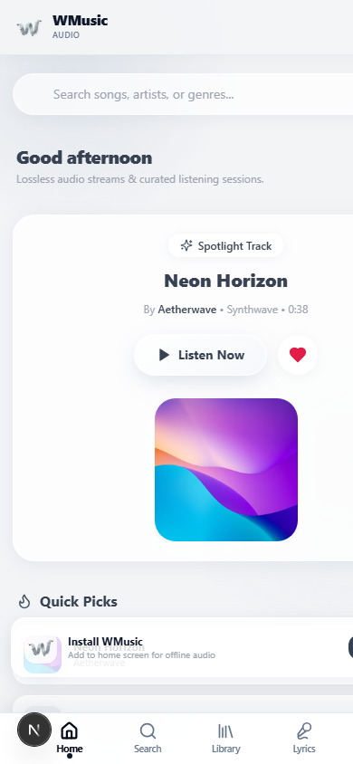
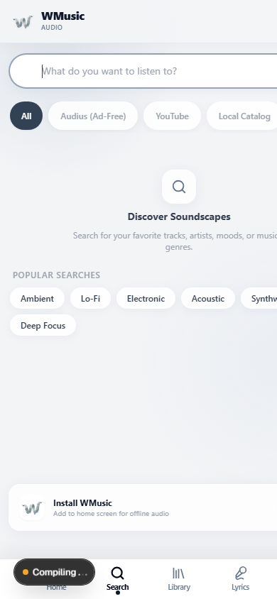
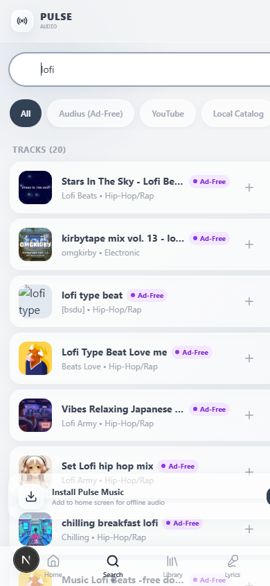
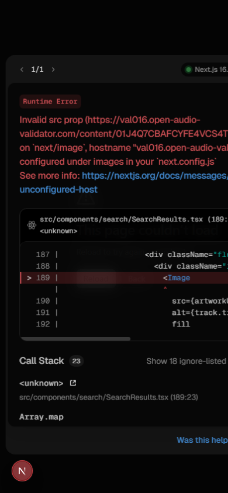
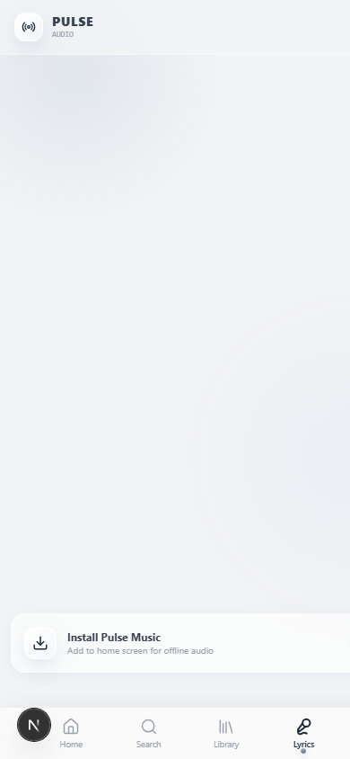
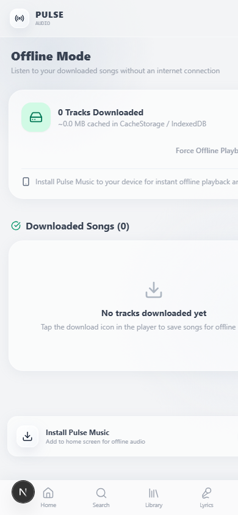
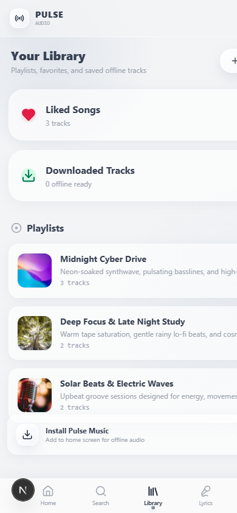
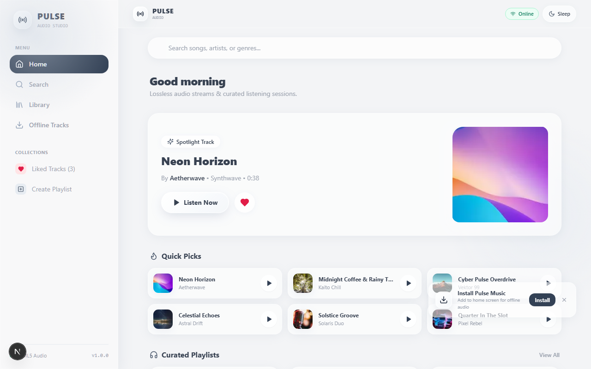

# 📖 Panduan Penggunaan WMusic & Dokumentasi Fitur

Selamat datang di **WMusic** — Aplikasi pemutar musik modern berbasis **Progressive Web Application (PWA)** dengan desain *Liquid Glass + Soft Grey*, performa audio *native* HTML5 tanpa jeda, lirik tersinkronisasi (*real-time LRC*), mode *offline* mandiri, serta **dukungan streaming resmi YouTube Video & Music**.

---

## 📸 Tangkapan Layar Aplikasi (Screenshots)

### 1. Halaman Utama (Mobile Home)
Tampilan *mobile-first* elegan dengan akses pencarian cepat, playlist unggulan (*Featured Streams*), daftar lagu terbaru, pemutar mini (*MiniPlayer*), dan navigasi bawah (*Bottom Navigation*).

---

### 2. Pencarian Lagu & Filter Kategori (Search & Filter Tabs)
Pencarian cepat berbasis *debounce* (tidak membebani jaringan di tiap ketukan), filter cepat berdasarkan kategori tab (**All**, **Audius (Ad-Free)**, **YouTube Videos**, **Local Catalog**, **Playlists**), dan hasil pencarian instan dengan badge penanda sumber musik (*Local*, *Ad-Free*, atau *YouTube*).

| Filter Kategori Tab | Hasil Pencarian Bebas Iklan (Audius) | Hasil Pencarian YouTube |
| :---: | :---: | :---: |
|  |  |  |

---

### 3. Layar Penuh Pemutar & Lirik Tersinkronisasi (Full Player & Synced Lyrics)
- **Shared-Element Transition**: Sentuh *MiniPlayer* di bagian bawah, cover album akan membesar secara mulus menjadi *FullPlayer*.
- **Synced Lyrics**: Teks lirik bergerak otomatis mengikuti ketukan lagu. Anda dapat **mengetuk baris lirik mana pun** untuk langsung melompat (*seek*) ke detik tersebut!
- **Tutup Pemutar**: Cukup usap (*swipe*) ke bawah atau tekan tombol panah bawah / tombol `Esc` pada keyboard.

---

### 4. Mode Offline & Manajemen Unduhan (Offline Mode)
Dengarkan lagu favorit Anda kapan saja tanpa koneksi internet atau saat kuota habis. Lagu berlisensi lokal disimpan secara aman di *CacheStorage* peramban Anda.

---

### 5. Koleksi & Pustaka Musik (Your Library)
Kelola daftar putar pribadi, track yang disukai (*Liked Songs*), dan riwayat pemutaran dengan satu sentuhan.

---

### 6. Tampilan Desktop Responsif (Desktop Layout)
Saat dibuka pada layar tablet atau laptop/komputer, tata letak otomatis bertransisi menggunakan bilah samping (*Sidebar*), katalog grid luas, dan bilah pemutar bawah persisten.

---

## 🎯 Panduan Langkah demi Langkah

### 1. Memutar dan Mengontrol Lagu (Katalog Lokal & YouTube)
1. **Memulai Pemutaran**: Sentuh judul lagu mana pun pada Halaman Utama atau Pencarian.
2. **Jeda / Lanjut**: Tekan tombol Play/Pause cair (*liquid button*) pada *MiniPlayer* atau *FullPlayer*.
3. **Mencari Lagu dari YouTube**:
   - Ketik artis atau lagu apa saja (misal: `"Coldplay"`, `"Taylor Swift"`, `"Indonesia Pusaka"`).
   - Lagu dari YouTube ditandai dengan badge khusus **YouTube**.
   - Sentuh lagu untuk mulai streaming. Pemutar video resmi YouTube akan otomatis aktif, lengkap dengan tampilan video jernih dan kontrol sinkron (Play, Pause, Scrubber, Volume, Speed).
4. **Antrean (*Up Next Queue*)**:
   - Buka ikon daftar lagu pada player untuk melihat antrean pemutaran.
   - Anda dapat menggeser urutan lagu (Naik / Turun), menghapus lagu dari antrean, atau membersihkan antrean dengan tombol **Clear**.
5. **Acak (*Shuffle*) & Ulang (*Repeat*)**:
   - Tombol **Shuffle** mengacak urutan lagu tanpa merusak daftar putar asli (ketika dimatikan, urutan kembali ke aslinya).
   - Tombol **Repeat** mendukung 3 mode: *Off*, *Repeat All* (ulang semua), dan *Repeat One* (ulang lagu yang sama terus menerus).
6. **Timer Tidur (*Sleep Timer*)**:
   - Sentuh ikon Bulan (*Moon*) pada *FullPlayer*.
   - Pilih durasi (15 menit, 30 menit, 45 menit, 60 menit, atau *End of Track*).
   - Menjelang waktu habis, musik akan meredup secara halus (*smooth volume fade-out*) selama 3 detik sebelum berhenti otomatis.

### 2. Cara Menggunakan Mode Offline
1. Buka lagu lokal yang ingin Anda simpan.
2. Pada layar pemutar, ketuk ikon **Unduh** (tanda panah ke bawah).
3. Setelah tanda centang hijau muncul, lagu telah tersimpan di memori perangkat.
4. Buka tab **Offline** di navigasi bawah untuk melihat dan memutar semua lagu yang telah diunduh bahkan saat mode pesawat (*Airplane Mode*) aktif!
> *Catatan*: Sesuai aturan lisensi YouTube ToS, video YouTube di-streaming secara live via pemutar resmi dan tidak dapat diunduh untuk pemutaran offline.

### 3. Cara Menginstal Aplikasi ke Layar Utama (PWA)
Aplikasi ini dapat diinstal layaknya aplikasi bawaan ponsel (tanpa perlu ke Google Play Store atau Apple App Store):
- **Di Android (Google Chrome)**:
  - Sentuh tombol **Install** pada spanduk di bagian bawah layar, atau buka menu Chrome (titik tiga) $\to$ pilih **"Add to Home screen"** / **"Instal aplikasi"**.
- **Di iOS (Apple Safari)**:
  - Buka aplikasi di Safari $\to$ ketuk tombol **Bagikan (*Share*)** (ikon kotak dengan panah ke atas) $\to$ gulir ke bawah dan pilih **"Add to Home Screen"** (*Tambah ke Layar Utama*).
- **Di Laptop / PC (Chrome / Edge)**:
  - Klik ikon komputer/instal di samping bilah URL $\to$ klik **Install**.

---

## 🎬 Integrasi Resmi YouTube Media Provider

Kini WMusic mendukung pencarian dan streaming jutaan lagu dan video musik dari **YouTube** secara resmi dan legal:

### 1. Kepatuhan Hukum & Arsitektur Resmi (*Official YouTube Player*)
- Sesuai dengan instruksi arsitektur dan persetujuan pengguna (*"tidak apa apa jika menggunakan video, yang penting dapat streaming"*), aplikasi **TIDAK mengekstrak/mengunduh audio mentah** yang melanggar hak cipta.
- Sebagai gantinya, aplikasi mengintegrasikan **Official YouTube IFrame Player API**:
  - Video ditampilkan secara legal di tengah layar *FullPlayer*.
  - Saat diminimalkan, video tampil sebagai *Mini Video (Picture-in-Picture)* di pojok bawah tanpa mengganggu penjelajahan aplikasi.
  - Video tidak akan terhenti atau *reload* saat beralih antara MiniPlayer dan FullPlayer berkat kontainer DOM persisten.

### 2. Pengalihan Driver Otomatis (*Multi-Provider Audio Bridge*)
Sistem pemutar WMusic dirancang modular:
- Saat memutar lagu lokal / S3 / CDN $\to$ Menggunakan **HTML5 Audio Engine native** berkecepatan tinggi dengan *byte-range streaming*.
- Saat memutar track YouTube $\to$ Pemutar audio native otomatis dijeda, dan **YouTube Driver** mengambil alih secara transparan.
- Semua tombol kontrol (Play, Pause, Next, Prev, Slider Durasi, Volume, Kecepatan Putar) berfungsi **sama persis** di kedua jenis media!

---

## 🎧 Integrasi Audius Open Music (100% Ad-Free Native Audio)

Bagi Anda yang menginginkan pengalaman mendengarkan musik murni **tanpa iklan (*100% Ad-Free*)**, tanpa video, dan hemat kuota, WMusic kini terintegrasi langsung dengan jaringan terdesentralisasi **Audius Open Music**:

### 1. Keunggulan Audius Ad-Free Provider
- **100% Bebas Iklan**: Tidak ada iklan sponsor, tidak ada pop-up, dan tidak ada audio ad interupsi.
- **Native HTML5 Audio**: Berbeda dengan YouTube yang membutuhkan pemutar video IFrame, Audius mengalirkan stream MP3 murni (*audio/mpeg*) berstandar RFC 7233 byte-range.
- **Putar di Latar Belakang (*Background Playback*)**: Musik tetap berputar lancar saat layar ponsel mati atau saat Anda membuka aplikasi lain.
- **Dukungan Penuh Fitur Lanjutan**:
  - Visualizer audio responsif.
  - Pengaturan kecepatan putar (0.5x hingga 2.0x).
  - Sleep timer dengan *fade-out* volume lembut.
  - Mode offline / simpan ke memori perangkat (*CacheStorage*).
- **Badge & Filter Khusus**: Semua lagu dari penyedia ini diberi label warna ungu **Ad-Free**. Anda dapat mengetuk tab filter **Audius (Ad-Free)** pada halaman pencarian untuk melihat katalog bebas iklan secara eksklusif.

### 2. Cara Menemukan Lagu Ad-Free
1. Buka tab **Search** (Pencarian).
2. Ketik nama artis, genre, atau lagu favorit (misal: `"electronic"`, `"lofi"`, `"remix"`, `"chill"`).
3. Ketuk tab **Audius (Ad-Free)** di bilah atas untuk menyaring lagu bebas iklan.
4. Ketuk lagu untuk langsung mendengarkan secara instan dengan engine native!

