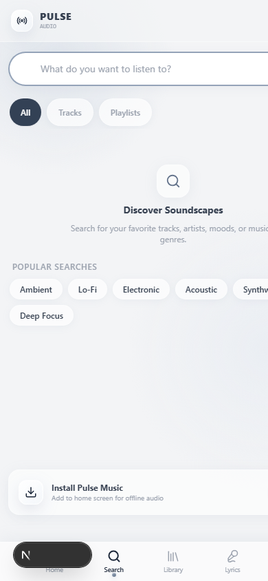

# 📖 Panduan Penggunaan Pulse Music & Dokumentasi Fitur

Selamat datang di **Pulse Music** — Aplikasi pemutar musik modern berbasis **Progressive Web Application (PWA)** dengan desain *Liquid Glass + Soft Grey*, performa audio *native* HTML5 tanpa jeda, lirik tersinkronisasi (*real-time LRC*), serta mode *offline* mandiri.

---

## 📸 Tangkapan Layar Aplikasi (Screenshots)

### 1. Halaman Utama (Mobile Home)
Tampilan *mobile-first* elegan dengan akses pencarian cepat, playlist unggulan (*Featured Streams*), daftar lagu terbaru, pemutar mini (*MiniPlayer*), dan navigasi bawah (*Bottom Navigation*).

---

### 2. Pencarian Lagu & Genre (Search & Filter)
Pencarian cepat berbasis *debounce* (tidak membebani jaringan di tiap ketukan), filter cepat berdasarkan genre (*Synthwave, Ambient, Lo-Fi, Cyberpunk*), dan hasil pencarian instan.

---

### 3. Layar Penuh Pemutar & Lirik Tersinkronisasi (Full Player & Synced Lyrics)
- **Shared-Element Transition**: Sentuh *MiniPlayer* di bagian bawah, cover album akan membesar secara mulus menjadi *FullPlayer*.
- **Synced Lyrics**: Teks lirik bergerak otomatis mengikuti ketukan lagu. Anda dapat **mengetuk baris lirik mana pun** untuk langsung melompat (*seek*) ke detik tersebut!
- **Tutup Pemutar**: Cukup usap (*swipe*) ke bawah atau tekan tombol panah bawah / tombol `Esc` pada keyboard.

---

### 4. Mode Offline & Manajemen Unduhan (Offline Mode)
Dengarkan lagu favorit Anda kapan saja tanpa koneksi internet atau saat kuota habis. Lagu disimpan secara aman di *CacheStorage* peramban Anda.

---

### 5. Koleksi & Pustaka Musik (Your Library)
Kelola daftar putar pribadi, track yang disukai (*Liked Songs*), dan riwayat pemutaran dengan satu sentuhan.

---

### 6. Tampilan Desktop Responsif (Desktop Layout)
Saat dibuka pada layar tablet atau laptop/komputer, tata letak otomatis bertransisi menggunakan bilah samping (*Sidebar*), katalog grid luas, dan bilah pemutar bawah persisten.

---

## 🎯 Panduan Langkah demi Langkah

### 1. Memutar dan Mengontrol Lagu
1. **Memulai Pemutaran**: Sentuh judul lagu mana pun pada Halaman Utama atau Pencarian.
2. **Jeda / Lanjut**: Tekan tombol Play/Pause cair (*liquid button*) pada *MiniPlayer* atau *FullPlayer*.
3. **Antrean (*Up Next Queue*)**:
   - Buka ikon daftar lagu pada player untuk melihat antrean pemutaran.
   - Anda dapat menggeser urutan lagu (Naik / Turun), menghapus lagu dari antrean, atau membersihkan antrean dengan tombol **Clear**.
4. **Acak (*Shuffle*) & Ulang (*Repeat*)**:
   - Tombol **Shuffle** mengacak urutan lagu tanpa merusak daftar putar asli (ketika dimatikan, urutan kembali ke aslinya).
   - Tombol **Repeat** mendukung 3 mode: *Off*, *Repeat All* (ulang semua), dan *Repeat One* (ulang lagu yang sama terus menerus).
5. **Timer Tidur (*Sleep Timer*)**:
   - Sentuh ikon Bulan (*Moon*) pada *FullPlayer*.
   - Pilih durasi (15 menit, 30 menit, 45 menit, 60 menit, atau *End of Track*).
   - Menjelang waktu habis, musik akan meredup secara halus (*smooth volume fade-out*) selama 3 detik sebelum berhenti otomatis.

### 2. Cara Menggunakan Mode Offline
1. Buka lagu yang ingin Anda simpan.
2. Pada layar pemutar, ketuk ikon **Unduh** (tanda panah ke bawah).
3. Setelah tanda centang hijau muncul, lagu telah tersimpan di memori perangkat.
4. Buka tab **Offline** di navigasi bawah untuk melihat dan memutar semua lagu yang telah diunduh bahkan saat mode pesawat (*Airplane Mode*) aktif!

### 3. Cara Menginstal Aplikasi ke Layar Utama (PWA)
Aplikasi ini dapat diinstal layaknya aplikasi bawaan ponsel (tanpa perlu ke Google Play Store atau Apple App Store):
- **Di Android (Google Chrome)**:
  - Sentuh tombol **Install** pada spanduk di bagian bawah layar, atau buka menu Chrome (titik tiga) $\to$ pilih **"Add to Home screen"** / **"Instal aplikasi"**.
- **Di iOS (Apple Safari)**:
  - Buka aplikasi di Safari $\to$ ketuk tombol **Bagikan (*Share*)** (ikon kotak dengan panah ke atas) $\to$ gulir ke bawah dan pilih **"Add to Home Screen"** (*Tambah ke Layar Utama*).
- **Di Laptop / PC (Chrome / Edge)**:
  - Klik ikon komputer/instal di samping bilah URL $\to$ klik **Install**.

---

## ❓ Mengapa Tidak Ada Lagu dari YouTube?

Banyak pengguna menanyakan: *"Saya ingin mencari lagu yang ada di YouTube, kenapa hasilnya tidak ada?"*

Berikut adalah penjelasan teknis, arsitektur, dan legalitas resminya:

### 1. Kepatuhan Hukum & Persyaratan Layanan (*Terms of Service*) YouTube
- Mengambil (*scraping*), mengunduh (*downloading*), atau mengekstrak aliran audio (*raw audio streaming/ripping*) langsung dari video YouTube **melanggar secara tegas YouTube Developer Terms of Service** dan hak cipta industri musik.
- Platform atau bot pihak ketiga yang mengekstrak MP3 diam-diam dari YouTube sering kali mengalami:
  - Pemblokiran alamat IP secara tiba-tiba oleh Google.
  - Tuntutan pelanggaran hak cipta digital (DMCA).
  - Kualitas audio yang tidak konsisten dan sering gagal putar (*broken streams*).

### 2. Arsitektur Bersih Berbasis `MediaProvider`
Aplikasi Pulse Music dibangun dengan standar arsitektur profesional:
- Pemutar audio menggunakan **HTML5 Audio Engine murni** dengan dukungan *RFC 7233 byte-range streaming* (memungkinkan *scrubbing* maju-mundur instan berkecepatan tinggi).
- Mesin pemutar terhubung ke antarmuka **`MediaProvider`** yang resmi dan terverifikasi:
  1. **Local Media Provider**: Katalog master berlisensi yang dimiliki sendiri.
  2. **S3 / Cloudflare R2 Provider**: Penyimpanan *object storage* resmi berskala cloud.
  3. **Authorized CDN Provider**: Layanan CDN audio dengan token enkripsi HMAC-SHA256.

### 3. Bagaimana Jika Ingin Mengintegrasikan YouTube di Masa Depan?
Jika fitur YouTube ditambahkan di masa depan:
- **Harus menggunakan Official YouTube IFrame Player API** (pemutar resmi YouTube lengkap dengan video dan lisensi resminya), **bukan** mengekstrak audio diam-diam ke pemutar native.
- Arsitektur `MediaProvider` pada Pulse Music sudah siap memisahkan *provider* resmi tersebut tanpa mengorbankan integritas pemutar native saat ini.
